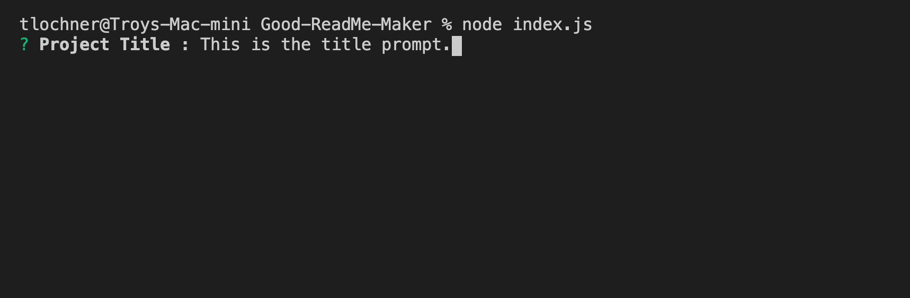

# Good-ReadMe-Maker
Command line tool to automatically create a Git Readme file. 

## Project Name: Good-ReadMe-Maker

## Project Description :
This is a command line tool to quickly create a template for a Git readme markdown file. 

## Table of Contents :
NA

## Installation Directions :
To run this application :
Download the repository
Run 'npm install'

## Application Usage :
** To execute this code - run the following command from the command line within the project directory. **

'node index.js'

A README_AUTO.MD file will be generated upon completion of the prompts.

## Contributors :
Troy Lochner

## App Tests :
NA

## Frequently Asked Questions :
None to date. 
